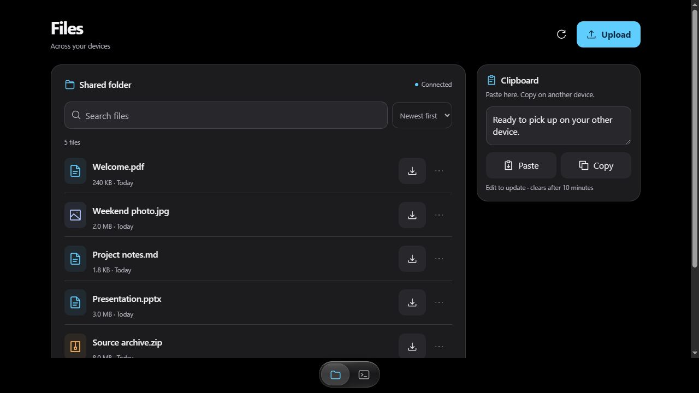
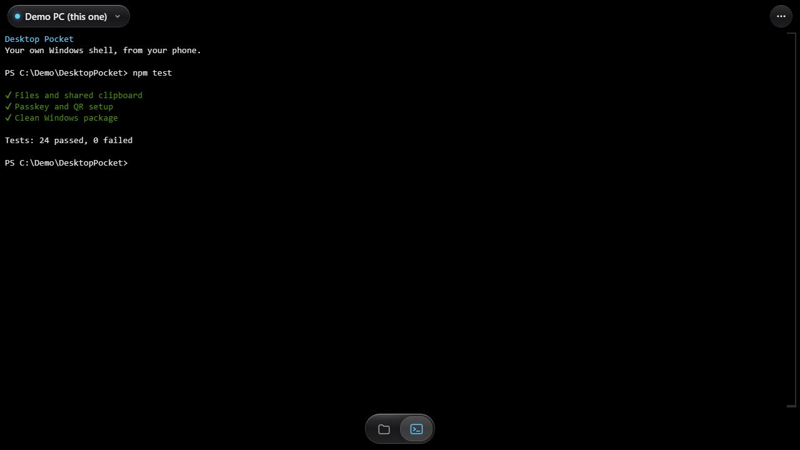

# Desktop Pocket — Windows

Your Windows desktop, terminal, shared files, and clipboard on your phone — privately through Tailscale, with passkey sign-in.

**Windows 10/11 x64 · Phone-first web app · Private Tailscale HTTPS · QR-first setup**

**[Download Windows package](https://github.com/hetyug04/desktop-pocket/raw/refs/heads/main/downloads/DesktopPocket-Windows.zip)** · [Setup guide](docs/SETUP.md) · [Coding-agent handoff](AGENT-SETUP.md)

## What you can do

- See and control your Windows desktop with touch; optionally see UAC and the lock screen.
- Open a real terminal on your computer from your phone.
- Upload a file into one shared folder, pick it up on another device, replace it, or move it to Trash.
- Share text with two clipboard buttons: **Paste** and **Copy**, plus an editable preview.
- Scan a QR and create a passkey. No private address or setup code to type.



<details>
<summary>Terminal and QR/passkey setup screenshots</summary>




</details>

Screenshots use the actual UI with disposable demo data. The example QR points to a non-working `.invalid` address, not a real computer. No personal desktop, credentials, or live enrollment QR is included.

## Quick setup

1. Download the **Windows package** above (recommended), or choose **Code → Download ZIP** / clone this repository. Extract the entire ZIP to a permanent folder such as Desktop/DesktopPocket. Do not run inside the ZIP. Keep the folder after setup.
2. Double-click **SETUP.cmd**. It checks Windows x64, installs missing Node.js LTS and Tailscale through winget if available, restores locked npm dependencies, and builds the Windows screen helper from source.
3. Sign into **your own Tailscale account** on the PC and phone when asked. Setup automatically opens a **scan-to-set-up page** on the PC. If the phone needs Tailscale, expand that page’s download section and scan the iPhone or Android QR.
4. Scan the large setup QR with your phone camera. It opens your private HTTPS app with the temporary enrollment code already filled in. Tap **Create passkey** and confirm with Face ID / Windows Hello. No address or code to type. Save the recovery kit with the page’s **Save recovery kit** / **Copy codes** buttons. In Safari, use Share → Add to Home Screen.

Normal setup does not install a system service, open LAN ports, add firewall rules, publish publicly, or alter UAC. If HTTPS setup fails, enable **HTTPS Certificates** on your own Tailscale admin console’s DNS page and rerun START.cmd. Do not use Funnel.

See the illustrated [setup and troubleshooting guide](docs/SETUP.md). For your friend's coding agent, send [AGENT-SETUP.md](AGENT-SETUP.md).

## Everyday use

- **START.cmd** / the Desktop Pocket shortcut: start the app and private Tailscale endpoint, then automatically display a scan-to-open QR page (or an enrollment QR if no passkey is set up yet). **STATUS.cmd** also prints the opening QR in its console.
- **STOP.cmd**: remove only Desktop Pocket’s HTTPS port 8443 and stop its server.
- **STATUS.cmd**: show the URL and connection state.
- **SECURITY-SETUP.cmd**: automatically display a fresh 15-minute passkey enrollment QR. In the app, **Security → Set up another phone — QR** does the same after verifying you with your passkey. Also accepts `status`, `recovery`, or `signout-all`. Recovery regenerates codes; signout-all ends all app sessions.
- The PC must stay awake. Start the app again after logging into Windows following a restart. There is no automatic-start service by default.
- Files: Upload, or drop files into the shared folder. Tap a name to open/download; the … menu has Download, Replace, and Move to Trash. Undo restores the most recent deletion. Clipboard uses Paste / Copy with an editable preview, not automatic OS clipboard sync.

## QR privacy and fallback

QR images are generated locally, not by an online QR service. Enrollment secrets travel in the URL fragment (`#`), not server-visible query strings, and are removed from the phone’s address/history immediately after reading. The QR only starts enrollment: Face ID / Windows Hello is still required. It expires after 15 minutes; creating a new one replaces the previous code. Existing passkeys are not reset.

The enrollment/recovery page is a private local file beside the machine key, with a Windows ACL allowing only its owner, SYSTEM and administrators. It is never served from the app. Close it after setup and do not share it or include it in a ZIP. The normal opening QR contains only the private app address. Camera-free fallback links/codes remain available; **Save recovery kit** avoids copying ten codes by hand. Signing into Tailscale, confirming passkeys, approving optional UAC, and adding to the Home Screen still require the platform’s own user interaction.

## Optional: full desktop, including UAC

Double-click **enable-full-desktop.cmd**, then approve the Windows administrator prompt locally. It downloads TightVNC 2.8.89 from its official publisher, verifies a pinned SHA-256 and publisher signature, and installs a localhost-only service. No firewall exceptions, public VNC listener, or weakened UAC settings. Existing TightVNC installations are not overwritten. Inspect `run/full-install-result.json` if setup fails.

Full desktop becomes the default after service setup. It supports the secure desktop/UAC and lock screen while the app’s normal-user web server remains running. This is not preboot access; Windows sign-out/restart still requires starting the app again. TightVNC can be removed through Windows Apps. Stopping Desktop Pocket does not uninstall that service.

## Independent installation and data

This repository and its clean ZIP are source-only. They contain **no machine keys, passwords, passkeys, recovery/setup codes, VNC secrets, personal screenshots, logs, shared files, runtime configuration, or node_modules**. They do not connect to the sender’s computer or tailnet. Only sanitized documentation screenshots are included.

Fresh setup creates your private machine key and passkey store in `%LOCALAPPDATA%/DesktopPocket/security/` with restricted Windows ACLs. `run/config.json` records the origin, key path, and shared Files host; `run/files/inbox` and `run/files/trash` are your data. Preserve both the security directory and runtime Files directories when updating. Existing installations keep their configured key/passkeys.

The OpenCode passkey gate is **off on fresh installs** and setup never changes port 443. An agent can add a deliberate local OpenCode integration later; Desktop Pocket does not install OpenCode or use an AI subscription.

## Coding agent setup

Give your agent **AGENT-SETUP.md**, or paste the text in **SHARE.txt**. It includes verification, troubleshooting and security boundaries. `powershell -NoProfile -ExecutionPolicy Bypass -File .\setup.ps1 -Check` checks the release manifest and local prerequisites without installing, starting, or publishing anything.

The package is Windows 10 (1809+) / Windows 11 x64. It needs internet access to fetch dependencies and prerequisites. A missing winget installation is handled with direct official download links. Windows ARM is not tested. macOS screen capture is not implemented; the existing Mac companion template is included for an agent to extend separately.

## Source and third-party components

Full app source and a locked npm manifest are included. See **THIRD-PARTY.md**. `scripts/package-windows.ps1` creates a clean shareable ZIP and SHA-256 sidecar using an explicit file allowlist. Never share your installed working folder, because it contains private runtime state.

## Development and verification

```powershell
npm ci --no-audit --no-fund
powershell -NoProfile -ExecutionPolicy Bypass -File .\build.ps1 -SkipIcons
node --test --test-concurrency=1 test/files.test.mjs test/package.test.mjs test/qr.test.mjs
powershell -NoProfile -ExecutionPolicy Bypass -File .\scripts\package-windows.ps1
```

Tests use disposable local state; Files tests use loopback port **4098** and include a streamed 1 GiB upload. Leave that port free. Normal app setup uses loopback **4097** behind private Tailscale Serve **8443**. Do not run old password-era tests from other working trees against a passkey installation.

| Source | Responsibility |
| --- | --- |
| server.mjs / lib | Capture, sessions/passkeys, Tailscale discovery, module hub, QR generation. |
| modules / public/tabs | Terminal and Files backend/frontend modules. |
| public | Phone-first shell, touch controls, security screens and PWA assets. |
| native/DesktopBridge.cs | Windows screen/input helper, compiled locally by build.ps1. |
| setup.ps1 / desktop-pocket.ps1 | Windows setup, private Serve lifecycle, launch shortcuts. |
| test | Files, packaging, passkey/QR and Windows ACL checks. |

The public repository contains no private working-tree history. Runtime data and generated binaries are excluded by `.gitignore` and the packaging allowlist. See [THIRD-PARTY.md](THIRD-PARTY.md) for bundled component licenses; publication alone does not add a new license grant for the application.
