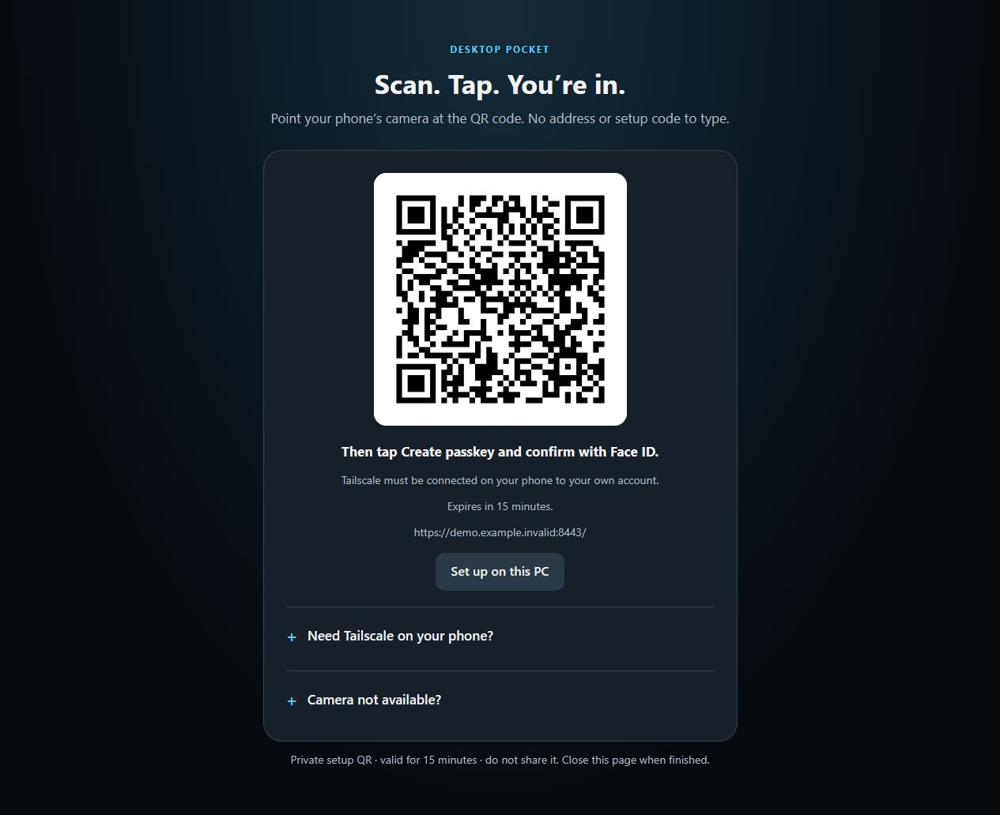
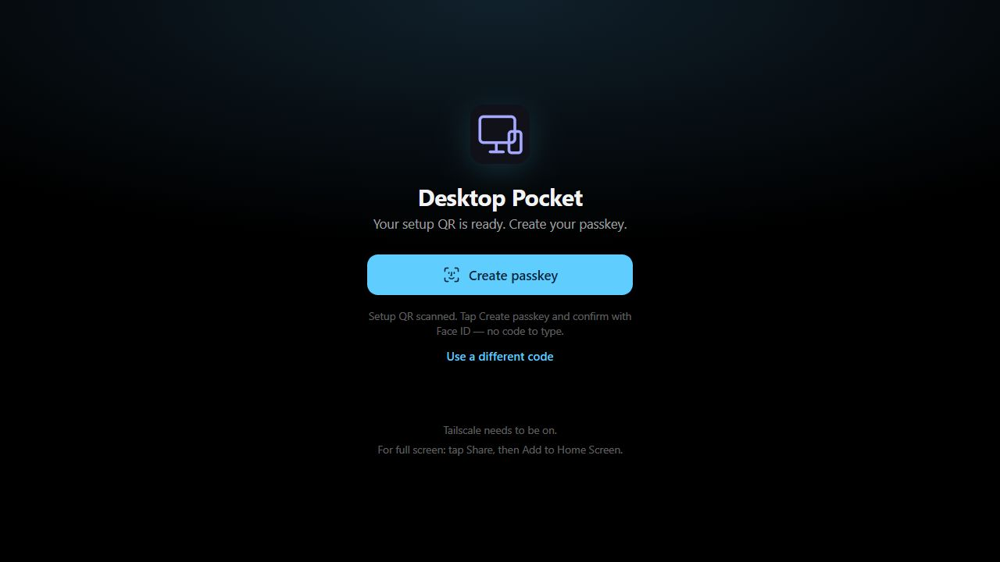

# Set up Desktop Pocket on your own Windows PC

## Requirements

- Windows 10 (1809 or later) or Windows 11, x64.
- Node.js 22 or newer, Tailscale, and the Windows .NET Framework 4.x compiler. Setup checks these and can install missing Node.js LTS/Tailscale through winget.
- Your PC and phone signed into **your own Tailscale account**.
- An up-to-date browser with passkeys. On iPhone, use Safari; optionally add it to the Home Screen.
- Internet access for initial dependency downloads. The PC must remain awake while you use it.

## Download, extract, double-click

1. On the repository page, choose **Code → Download ZIP**. Extract the entire ZIP into a permanent local folder. Do not run scripts inside the ZIP. Alternatively, clone the repository.
2. Double-click **SETUP.cmd**. Follow Windows/installer prompts if prerequisites need installing. Sign into Tailscale on the PC when requested.
3. A local QR page opens automatically. If your phone needs Tailscale, expand **Need Tailscale on your phone?** and scan the appropriate download QR. Sign into the same account on your phone and connect it.
4. Scan the large setup QR with your phone camera. Tap **Create passkey** and approve Face ID/Windows Hello. There is no address or enrollment code to type.
5. Save the recovery kit using the local page's **Save recovery kit** button. Keep it private. On iPhone, Safari's **Share → Add to Home Screen** makes it feel like an app.

These images show the actual UI using a disposable local demo fixture. The example QR points to `demo.example.invalid`, not a real computer, and cannot enroll a passkey. Your own installation generates its own private address, keys, and QR codes.

## Start and stop

| File | What it does |
| --- | --- |
| SETUP.cmd | Install prerequisites, build from source, and start QR-first setup. |
| START.cmd | Start Desktop Pocket and its private Tailscale Serve endpoint, then show an opening QR. |
| STOP.cmd | Stop the app and remove only its Serve endpoint on port 8443. |
| STATUS.cmd | Show status and an opening QR in the console. |
| SECURITY-SETUP.cmd | Show a fresh, 15-minute enrollment QR. Existing passkeys remain intact. |
| enable-full-desktop.cmd | Optional administrator-approved full-desktop/UAC support. |

There is no automatic startup service for the web app. After restarting or signing out of Windows, sign in locally and run START.cmd again.

## Use the tabs

- **Screen:** view and control your desktop with touch. Optional full-desktop mode can show the secure desktop/UAC and lock screen while the web app stays running.
- **Terminal:** a real shell on your computer, with a computer picker and phone-friendly keys. Commands run with the web server user's permissions.
- **Files:** upload from any connected device, then download on another. You can also place files directly in `run/files/inbox`. Tap the name to preview/download; use **… → Replace with edited file** to upload a replacement, or **Move to Trash** and Undo to restore. There is no in-browser document editor.
- **Clipboard:** Paste shares the current device's clipboard; Copy puts the shared text onto the current device. Edit the preview to update it. Text clears after 10 minutes. This is explicit sharing, not continuous background OS clipboard sync.

## Optional UAC/lock-screen access

Run **enable-full-desktop.cmd** and approve the Windows administrator prompt on the PC. This downloads the pinned, publisher-verified TightVNC service and binds it to localhost only. It does not disable UAC, open firewall ports, or overwrite an existing TightVNC installation. Inspect `run/full-install-result.json` if setup fails.

This is not preboot or unattended access after Windows sign-out: the normal-user Desktop Pocket web server still needs to be running. Stopping Desktop Pocket does not uninstall the optional TightVNC service; uninstall it through Windows Apps if no longer needed.

## Troubleshooting

| Symptom | Fix |
| --- | --- |
| HTTPS/Serve is not enabled | Enable **HTTPS Certificates** on your Tailscale admin console's **DNS** page; follow Tailscale's Serve enablement if prompted, then run START.cmd. Never substitute Funnel. |
| Phone cannot open the app | Connect Tailscale on both devices to the same account, check the PC is awake, then rescan the QR from START.cmd. Check STATUS.cmd. |
| Setup QR expired | Run SECURITY-SETUP.cmd for a new QR. Do not delete the passkey store. |
| Black/unavailable screen during UAC | Install the optional full-desktop service; keep secure desktop enabled. |
| Port 4097 or 8443 is already in use | Stop the older Desktop Pocket copy with its own STOP.cmd. Do not kill unrelated apps or overwrite their Serve routes. |
| Node/Tailscale not found after install | Close and reopen SETUP.cmd to refresh PATH. Without winget, use the official vendor downloads printed by setup. |
| node-pty native dependency fails | Use supported Node.js LTS x64. Give the error to your coding agent; a source build may require official Python/MSVC build tools. |

## Updates and backups

Keep the installed folder and its `run` directory. Preserve `%LOCALAPPDATA%/DesktopPocket/security` and `run/files/inbox` / `run/files/trash` before replacing source files. Existing configurations keep their own identity; setup is not a factory reset. Older installations may use a different secret path recorded in `run/config.json`.

Never share your installed working folder. Share this public repository or a clean ZIP built with `scripts/package-windows.ps1`. See [AGENT-SETUP.md](../AGENT-SETUP.md) for agent verification and [THIRD-PARTY.md](../THIRD-PARTY.md) for component notices.
